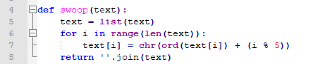

# Lemme In - 30 points

We're given the source code to a python program for checking passwords:

```python
def roll(text):
	return text[::-1]

def swoop(text):
	text = list(text)
	for i in range(len(text)):
		text[i] = chr(ord(text[i]) + (i % 5))
	return ''.join(text)

password = input("Enter the password: ")
if swoop(roll(password)) == "}12u7#dvl{$`fos_4jwchb}jelg":
	print("Welcome in!")
else:
	print("Sorry, wrong password.")
```

Well, we hate python, so we rewrite our program in C:

```C
#include <stdio.h>
#include <string.h>

// https://android.googlesource.com/kernel/lk/+/qcom-dima-8x74-fixes/lib/libc/string/strrev.c
void strrev(unsigned char *str) {
        int i;
        int j;
        unsigned char a;
        unsigned len = strlen((const char *)str);
        for (i = 0, j = len - 1; i < j; i++, j--)
        {
                a = str[i];
                str[i] = str[j];
                str[j] = a;
        }
}

void roll(char *text) {
        strrev(text);
}

void swoop(char *text) {
        for (int i=0; i<strlen(text); i++) {
                text[i] += (i % 5);
        }
}

int main() {
        char password[256];
        printf("Enter the password: ");
        scanf("%256s%*c", password);
        roll(password);
        swoop(password);
        if (strcmp(password, "}12u7#dvl{$`fos_4jwchb}jelg") == 0) {
                printf("Welcome in!\n");
        }
        else {
                printf("Sorry, wrong password.\n");
        }
}
```

We compile with `gcc lemmein.c -o lemmein`, and we run it:

```
ethan@DESKTOP-4SFI5GS$ ./lemmein
Enter the password:
```

Seems that it prompts us for a password. Let's check out the binary with our favorite tool, Binary Ninja Cloud!

We load it in, and take a look at the analysis for the `main` function. We use the HLIL (high level intermediate language) function of Binja cloud to see that the program takes in input, processes it, and compares it to a static string. A flagchecker!


Let's see what each of the functions do. First, the `roll` function is called. We look at the decompilation:


Ah. A wrapper for the strrev() function. Googling this function reveals that it just reverses a string.

Onto the next function! We look at the `swoop` function in Binja cloud, and see a more complex function:


Seems that it's a for loop: the program iterates over the text until the end, and changes each character by adding some amount to each character.

How much? Well, that's a hard question, because I don't want to read unreadable Binja output. We spend hours on this, until we get to our last resort. We read the python source code. (ew)



Seems that we've got this. The value that's added is the index mod 5. 

We write a solve script in C (because we hate python):

```C
#include <stdio.h>
#include <string.h>

// https://android.googlesource.com/kernel/lk/+/qcom-dima-8x74-fixes/lib/libc/string/strrev.c
void strrev(unsigned char *str) {
        int i;
        int j;
        unsigned char a;
        unsigned len = strlen((const char *)str);
        for (i = 0, j = len - 1; i < j; i++, j--)
        {
                a = str[i];
                str[i] = str[j];
                str[j] = a;
        }
}

void unroll(char *text) {
        strrev(text);
}

void unswoop(char *text) {
        for (int i=0; i<strlen(text); i++) {
                text[i] -= (i % 5);
        }
}

int main() {
        char password[256];
        printf("Enter the encrypted password: ");
        scanf("%256s%*c", password);
        unswoop(password);
        unroll(password);
        puts(password);
}
```

We run it:
```
ethan@DESKTOP-4SFI5GS$ ./lemmein_solve
Enter the encrypted password: }12u7#dvl{$`fos_4jwchb}jelg
flag{ah_th3_old_$witc#3r00}
```

We get the flag: `flag{ah_th3_old_$witc#3r00}`!

Thanks to 0xmmalik for a great challenge!
